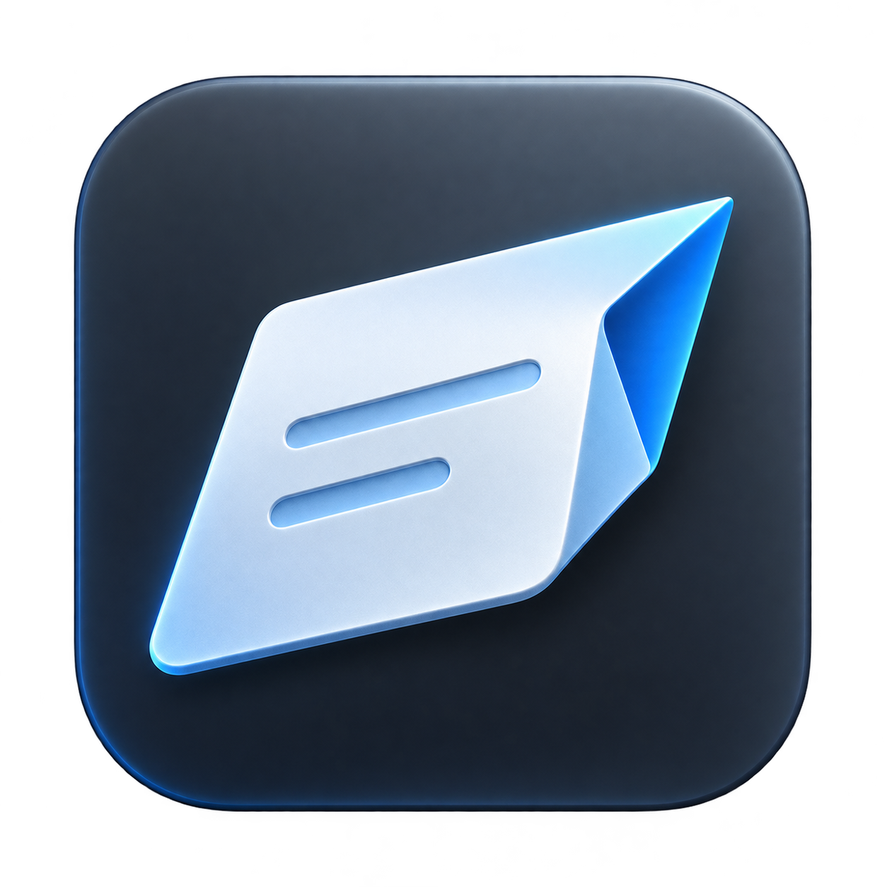

<p align="center">
  
</p>

# Jotway

**Think it. Type it. Done.**

Jotway is a native macOS launcher. Press a shortcut, type a sentence, and turn a thought into a note, a task into a reminder, or a plan into a calendar event. Search the web and open apps from the same place.

[简体中文](README.md) · **English**

Requires macOS 15 or later. Release packages currently target Apple Silicon.

## One sentence, straight to your everyday tools

Start with what you want to do. Check the destination Jotway shows, then press Enter—without first opening the destination app and finding where to type.

| What you want to do | Try typing | After confirmation |
| --- | --- | --- |
| Keep an idea | `Note this: visit Kyoto on my next trip` | Create a note in Apple Notes |
| Remember a task | `Remind me to reply to the client` | Create a reminder in Apple Reminders |
| Schedule some time | `Add to calendar: design discussion tomorrow from 3 to 4 pm` | Create an event in Apple Calendar |
| Find information | `Google search macOS keyboard shortcuts` | Open a Google search in Chrome |
| Open an app | `WeChat` | Open WeChat, if installed on your Mac |

Notes, Reminders, and Calendar require a destination and the relevant permissions to be set up first. Natural-language date and time extraction requires DeepSeek configuration and AI text processing enabled for that action. When disabled or extraction fails, reminders default to the current time, and calendar events default to one hour starting now.

## Fewer switches, fewer interruptions

- **Open it from anywhere.** Set a global shortcut, or open the quick record panel from the menu bar or Dock.
- **Stay on the keyboard.** Enter confirms; Shift+Enter adds a new line. When multiple destinations are available, use `⌥↑` / `⌥↓` to switch, or click to select one.
- **Open apps quickly.** Type an installed app's name to match it locally, check the suggested destination, then press Enter to open it.
- **Pick up where you left off.** Hide the panel and return to your draft during the same app session.
- **Retry when something fails.** Failed actions preserve your text and show a message so you can make a correction or choose another destination.
- **Feel at home on macOS.** Built with SwiftUI and AppKit, with support for system light and dark appearances, Reduce Transparency, and Increase Contrast.

## Suggested destinations. Your decision.

Jotway uses local rules to match explicit phrases such as “提醒我” (remind me) or “记一下” (note this). Configure optional **Jev intent recognition** to get destination suggestions from more natural phrasing.

The destination appears before execution, and you can change it at any time. Your choice takes priority over the suggestion; Enter confirms the action. Without Jev, or when recognition is unavailable, local matching and a configured default action remain available. Jotway prefers Apple Notes as the default.

## Shape your words for where they belong

Optional **AI text processing** helps each of the three storage actions:

- **Notes:** tidy up wording and create a concise title. Add a fixed tag line, or generate related tags when AI processing is enabled.
- **Reminders:** clean up task text and extract a due date.
- **Calendar:** clean up event text and extract start and end times.

Each action has its own switch and customizable writing instructions. This processing path currently uses DeepSeek and requires its API key. If AI is unavailable, Jotway falls back to the original text. Basic saving, web search, and app launching work without AI.

## Get started

1. Open Jotway and follow the welcome guide to set a global shortcut.
2. In **Settings → Actions**, choose a Notes folder, Reminders list, or calendar, and grant the required permissions.
3. Open the panel, type `My first idea`, check the destination, and press Enter.

Add Jev intent recognition or DeepSeek text processing whenever you want those capabilities. See the [first-use guide](docs/product/first-use.md) and [settings guide](docs/product/settings.md) for details.

## Your content and privacy

Content goes to the app you choose. Jotway has no browsable inbox or content history. The editor accepts multi-line plain text; unsubmitted drafts stay in memory and are cleared when the app exits or restarts.

When Jev or AI text processing is enabled, the relevant text is sent to the corresponding service. Confirming a destination may save full-text intent-feedback samples locally. Corrections are limited to the latest 200 and can be cleared in Settings; accepted suggestion samples currently have no retention limit or clear control. See [intent recognition](docs/integrations/jev-intent-research.md) for details.

## Build from source

Requires Swift 6.2 and the macOS 26 SDK.

```bash
swift build
swift test
./scripts/build-app.sh
```

Explore the [documentation](docs/jotway.md), [development environment](docs/development/environment.md), and [release workflow](docs/product/updates.md) for more.

See [Third-party notices](THIRD_PARTY_NOTICES.md) for dependency sources and licenses.
