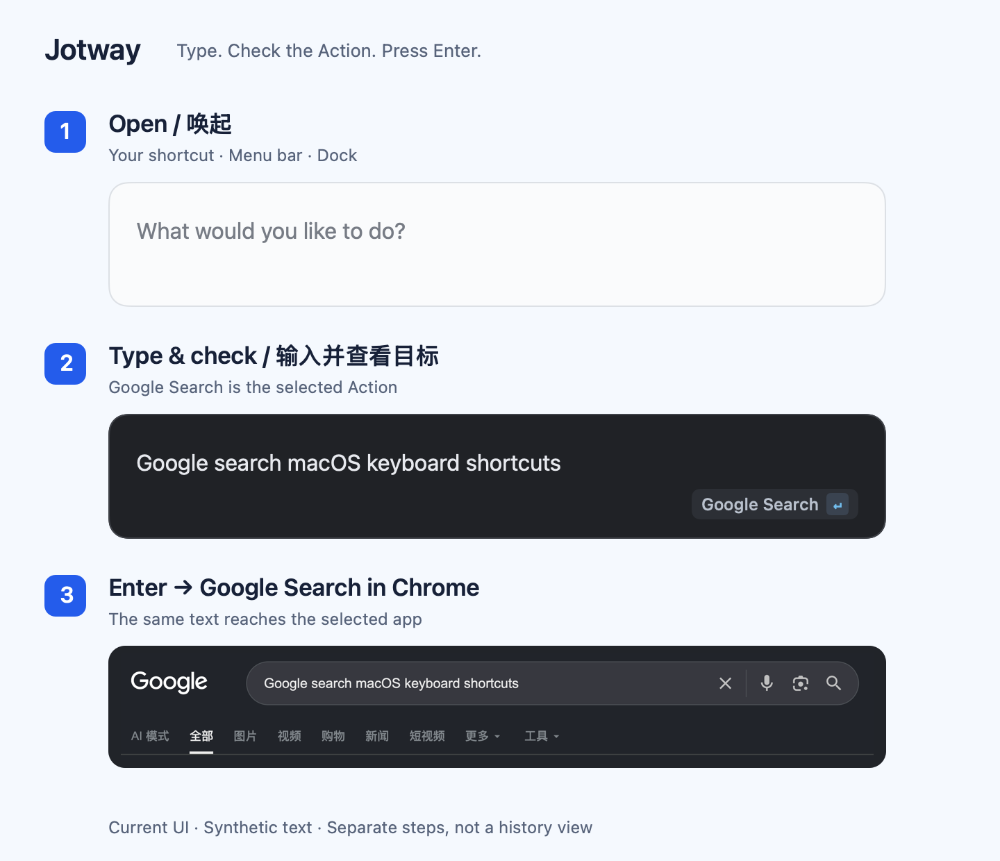

<p align="center">
  
</p>

# Jotway

**想到，输入，搞定。**

Jotway 是一个原生 macOS 启动器。用快捷键唤起，写下一句话，把想法存进备忘录、把待办交给提醒事项、把安排放进日历。搜索信息、打开应用，也在同一个入口完成。



合成文字的分步示例：当前面板的隔离渲染，以及 Chrome 搜索页的真实裁图。这是使用流程，不是可浏览的历史记录。

[English](README.md) · **简体中文**

支持 macOS 15 及以上版本，发行包目前面向 Apple Silicon。

## 一句话，接上你的日常工具

不用先打开目标应用、找到输入位置。先写下想做的事，确认 Jotway 显示的目标，再按 Enter。

| 想做什么 | 试着输入 | 确认后 |
| --- | --- | --- |
| 留住一个想法 | `记一下：下次旅行想去京都` | 在 Apple Notes 中创建备忘录 |
| 记住一件待办 | `提醒我给客户回邮件` | 在 Apple Reminders 中创建提醒事项 |
| 安排一段时间 | `加到日历：明天下午三点到四点讨论设计方案` | 在 Apple Calendar 中创建日程 |
| 查找信息 | `Google 搜 macOS 快捷键` | 在 Chrome 中打开 Google 搜索 |
| 打开应用 | `打开 微信` | 打开本机已安装的微信 |

备忘录、提醒事项和日历需要先在设置中选择保存位置，并授予相关权限。自然语言日期与时间提取需要配置 DeepSeek 并开启对应 action 的 AI 整理；关闭或提取失败时，提醒时间默认为当前时间，日程默认为从当前时间开始的一小时。

## 少切换，少打断

- **随时唤起**：自定义全局快捷键，也能从菜单栏或 Dock 打开快速记录面板。
- **键盘完成操作**：Enter 确认，Shift+Enter 换行；有多个可用目标时，用 `⌥↑` / `⌥↓` 切换，也可以点击选择。
- **快速打开应用**：直接输入应用名称或「打开 应用名」，通过本地识别匹配已安装的应用，确认后按 Enter 打开。
- **写到一半也能继续**：隐藏面板后，草稿仍在当前会话中；再次唤起即可接着写。
- **失败后可以重试**：执行失败时保留原文，并给出提示，方便修正或改选目标。
- **贴合 macOS**：基于 SwiftUI 与 AppKit，适配系统浅色、深色外观，以及降低透明度和增强对比度设置。

## 理解意图，由你确认

输入「提醒我」或「记一下」等明确表达时，Jotway 可以通过本地规则匹配目标。配置可选的 **Jev 意图识别** 后，也能根据更自然的表达推荐合适的 action。

目标会在执行前显示，你随时可以更改。你的选择优先于识别建议，按 Enter 才会执行。未配置 Jev 或识别不可用时，仍可使用本地匹配与已配置的默认 action；Jotway 优先使用 Apple Notes。

## 让文字更适合它的去处

可选的 **AI 文字整理** 为三个存入类 action 分别提供帮助：

- **备忘录**：整理表达、提炼标题；可配置固定标签文字，并在 AI 整理时生成相关标签。
- **提醒事项**：整理待办内容，提取截止时间。
- **日历**：整理日程内容，提取开始和结束时间。

每个 action 都能独立开关 AI 整理、自定义整理风格。目前这条处理路径使用 DeepSeek，需要配置相应 API Key。AI 不可用时回退到原文；基础存入、搜索和应用启动不依赖 AI。

## 开始使用

1. 打开 Jotway，按首次使用引导设置全局快捷键。
2. 在 **设置 → Actions** 中选择备忘录文件夹、提醒事项列表或日历，完成所需授权。
3. 唤起面板，输入 `记一下：我的第一个想法`，确认目标后按 Enter。

想启用智能能力时，再配置 Jev 意图识别或 DeepSeek 文字整理。详细操作见[首次使用指南](docs/product/first-use.md)和[设置说明](docs/product/settings.md)。

## 内容与隐私

内容存入你选择的应用，Jotway 不提供可浏览的收件箱或内容历史。编辑区支持多行纯文字；未执行的草稿仅保留在内存中，退出或重启后清空。

启用 Jev 或 AI 文字整理时，相关正文会发送给对应服务。确认目标时，本地意图反馈可能保存完整正文样本：纠正样本最多保留 200 条，可在设置中清除；已接受的建议样本目前没有保留期限或清除入口。详情见[意图识别说明](docs/integrations/jev-intent-research.md)。

## 从源码构建

需要 Swift 6.2 和 macOS 26 SDK。

```bash
swift build
swift test
./scripts/build-app.sh
```

完整的产品与开发资料见[文档入口](docs/jotway.md)，构建配置见[开发环境](docs/development/environment.md)，发布流程见[应用更新](docs/product/updates.md)。

第三方依赖及许可证见 [Third-party notices](THIRD_PARTY_NOTICES.md)。

## 许可证

Jotway 采用 GNU 通用公共许可证第三版（GPLv3）。详见 [LICENSE](LICENSE)。
