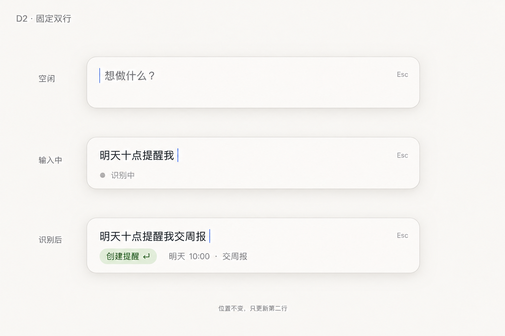

# Launcher UI: fixed action rows

> Role: **Work**
> Status: active design brief; current behavior remains authoritative in code and [Architecture](architecture.md).

## Problem

The panel's lower area changes height and hierarchy as recognition, preview, fallback, and errors arrive. The selected destination can be visually separated from the Enter action, making the interface feel like a suggestion system rather than a launcher.

## Target

Keep a stable two-row action area below the editor:

1. **Action row**: icon, selected action title, and the Enter affordance.
2. **Detail row**: one-line prepared result or destination detail; hidden without leaving an empty row when no detail exists.

The editor and action row keep a stable vertical relationship. Recognition or preview updates content in place instead of growing a second card.

## Interaction

- Enter executes the target currently shown in the action row.
- Shift+Enter inserts a newline.
- Option-up/down cycles available actions without a new network request.
- Clicking the action row opens an explicit candidate list; ordinary recognition does not expand it automatically.
- The candidate list remains inside the same panel and yields keyboard handling to Chinese input composition first.
- Errors replace the summary line with a bounded message; details may expand only on deliberate user action.

## State rules

- Explicit selection outranks local keywords, which outrank Jev, which outranks the default action.
- A late preview for an old draft/action is discarded.
- Image-bearing drafts show only actions that accept images.
- Pending recognition never blocks immediate execution through the current safe target.
- Send/search actions never appear as an implicit fallback.

## Acceptance

- Typing, recognition, preview completion, and error display do not move the editor vertically.
- The displayed action always matches what Enter will execute.
- Rapid typing and repeated Enter produce at most one submission.
- Candidate selection, input-method composition, focus return, light/dark appearance, and narrow-screen placement are checked in the packaged app.
